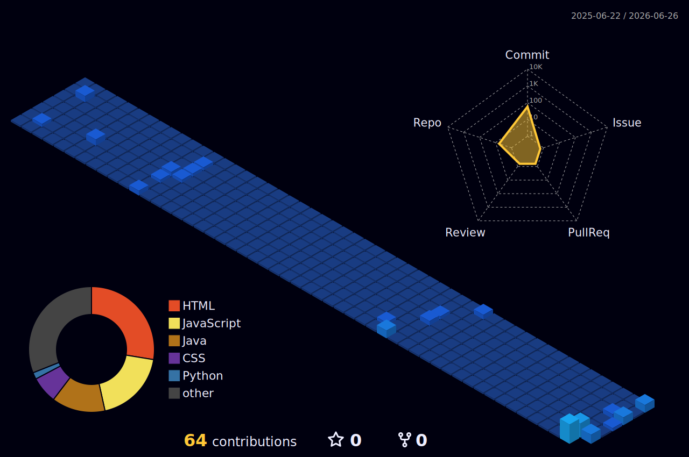

<!-- HEADERS & INTRO -->

  
  
   
  
  

  
  
  
  

  

 

<!-- GITHUB STATS - PREMIUM LAYOUT -->
<h2>📊 GitHub Analytics & Contributions</h2>

  
  

 

<!-- 3D CONTRIB GRAPH -->

  <h3>Contributions in 3D</h3>
  

<!-- SNAKE ANIMATION -->

  <h3>GitHub Contribution Snake</h3>
  <picture>
    <source media="(prefers-color-scheme: dark)" srcset="https://raw.githubusercontent.com/Prakash453345/Prakash453345/output/github-snake-dark.svg" />
    <source media="(prefers-color-scheme: light)" srcset="https://raw.githubusercontent.com/Prakash453345/Prakash453345/output/github-snake.svg" />
    
  </picture>

 

  

